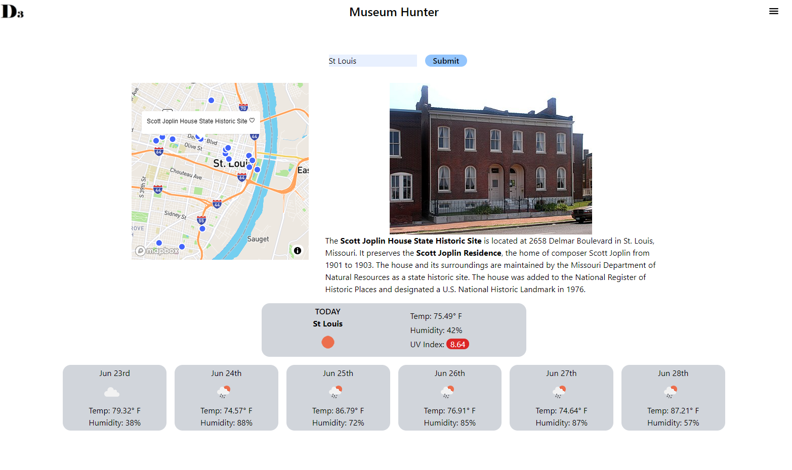

# Name of Project

## Table of Contents

- [Overview](#overview)
- [Built With](#built-with)
- [Features](#features)
- [Contact](#contact)
- [Acknowledgements](#acknowledgements)

## Overview

<!--
Describe your overall experience in a couple of sentences.
List a few specific technical things that you learned or improved on.
Share any other tips or guidance for others attempting this or something similar. -->

1. Live demo - https://tylaw93.github.io/Travel_project/

Tyler Lawson

Mike Champion
Overall this was a great experience, working with someone else for the first time on a collaborative sense. Communicating so that we are on the same page as the project progresses and evaluating our scope as the deadline gets closer. Looking forward to the next project.
I was able to get more practice with APIs on the weather portion and got deep into the Tailwind documentation more than once.
Tips and tricks for this type of project? Read the documentation, console.log is your friend, commit early and often.

### Built With

TailwindCSS - https://tailwindcss.com/
MomentJS - https://momentjs.com/
OpenWeatherMap API - https://openweathermap.org/
Mapbox API - https://www.mapbox.com/
OpenTripMap API - https://opentripmap.io

## Features

A travel and entertainment planning app. You enter a location, either city/state you’ll be travelling through and get back a map of locations in that area, this search will also return a weather forecast for the next week.

## Contact

<!-- TODO: Include icons and links to your RELEVANT, PROFESSIONAL 'DEV-ORIENTED' social media. LinkedIn and dev.to are minimum. -->

Tyler Lawson

Mike Champion
https://www.linkedin.com/in/mike-champion-868b8075/
https://dev.to/mikechampion

## Acknowledgements

<!-- TODO: List any blog posts, tutorials or plugins that you may have used to complete the project. Only list those that had a significant impact. Obviously, we all 'Google' stuff while working on our things, but maybe something in particular stood out as a 'major contributor' to your skill set for this project. -->

Tyler Lawson

Mike Champion
I did a bit of Googling during this project, mainly for things that I got 90% of the way there and needed a little hint at the end Tailwind documentation was a big help. I did watch a Tailwind intro from TraversyMedia on YouTube which was great in helping me decide to move on when Bulma was causing a headache.
